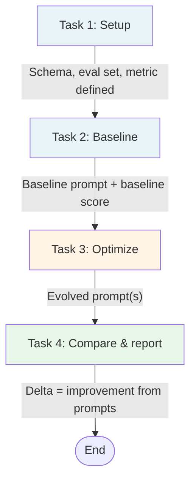

# High-Level Overview: Prompt-Optimized Document Interpretation

**BMW × MIT GenAI Lab — Continuous Evaluation & Autonomous Prompt Optimization**

This document introduces the project at a glance and uses diagrams to show how we move from one phase to the next. For detailed design choices, see `ARCHITECTURE_AND_INITIAL_STEPS.md`.

### How to see the flowcharts

The diagrams are Mermaid code blocks in this file. Most editors show the code, not the picture. Use one of these:

**Option A — In your browser (no install)**  
1. Open **[mermaid.live](https://mermaid.live/)** in a browser.  
2. In this file, select one full diagram: from the line ` ```mermaid ` down to the closing ` ``` `.  
3. Copy (Cmd+C / Ctrl+C) and paste into the **left** panel on mermaid.live.  
4. The diagram appears on the right. You can download it as PNG or SVG.

**Option B — In Cursor / VS Code**  
1. Install the extension **“Markdown Preview Mermaid Support”** (search in Extensions).  
2. Open this file, then open the Markdown preview: **Cmd+Shift+V** (Mac) or **Ctrl+Shift+V** (Windows), or click the preview icon in the top-right of the editor.  
3. The preview should render all Mermaid blocks as diagrams.

---

## The Idea in One Sentence

We take a **general PDF** (e.g. a repair order that follows a given schema), feed it to an **LLM**, and show that **evolving the system prompt**—with the same model and the same documents—yields **measurable improvement** in how well the document is interpreted.

---

## What We’re Proving

| We care about | We don’t optimize for |
|---------------|------------------------|
| **Improvement from better prompts** (baseline vs evolved) | Raw accuracy (e.g. “95% of fields correct”) |
| Same model, same data, **only prompt changes** | Bigger models, more training data, or better OCR |

So the main result is: **“Prompt optimization gave us a +X% gain over baseline.”**

---

## End-to-End Flow: From Setup to Result

The project moves through four high-level phases. Each phase feeds the next.


**In words:**

1. **Setup** — Define what the agent must do (e.g. extract fields), what the document looks like (schema), which documents we evaluate on, and how we score (metric).
2. **Baseline** — One initial system prompt. Run the LLM on all eval documents. Record the score. This is “baseline LLM.”
3. **Optimize** — Automatically suggest prompt changes, re-run on the same documents, keep changes that improve the score. Repeat until we have an evolved prompt (or a budget is exhausted).
4. **Compare** — Report baseline score vs optimized score. The difference is the improvement we attribute to better prompts.

---

## What Happens in a Single Run (One Document)

For every evaluation—whether baseline or optimized—the **pipeline** is the same. Only the **prompt text** changes.


**Flow:** Document + schema → **fixed** encoding → LLM receives **prompt** + encoded document → **fixed** parsing → output is compared to ground truth → **metric** (and optional text feedback for the optimizer).

---

## The Optimization Loop (Task to Task)

Inside **Phase 3 (Optimize)**, we repeat the following cycle until we are satisfied or we hit a budget (e.g. number of rollouts).


**Task-to-task summary:**

| Step | What happens |
|------|-------------------------------|
| **Select** | Pick a candidate prompt (e.g. from the pool of best-so-far, Pareto-style). |
| **Run** | Execute the system with that prompt on a small batch of documents. |
| **Evaluate** | Compute score µ and, for the optimizer, text feedback µf (e.g. “RO number wrong; VIN missing”). |
| **Reflect** | An LLM looks at (prompt, traces, score, feedback) and proposes a revised prompt. |
| **Update** | Apply the revision → new candidate prompt. |
| **Re-test** | Run with the new prompt on the same batch. |
| **Decide** | If score improved, keep the candidate and add it to the pool; else discard. |
| **Repeat** | Select another candidate and repeat until budget is exhausted. |
| **Report** | Return the best-performing prompt (e.g. by aggregate score on the eval set). |

---

## What Stays Fixed vs What Changes

Keeping this split clear is what lets us **attribute improvement to the prompt**.


| Fixed | Variable |
|-------|----------|
| LLM (no fine-tuning) | **System prompt** |
| How we turn PDF → model input (e.g. page images or OCR) | |
| How we parse model output into fields | |
| Evaluation metric and ground truth | |
| Eval set (same docs for baseline and optimized) | |

**Result:** Any gain in the metric when we switch from baseline to optimized prompt is **by design** due to the prompt.

---

## Data Flow at a Glance


- **Schema** → summarized and embedded in the **prompt** (fixed structure, optimizable wording).
- **Documents** → encoded once (e.g. images or OCR) and fed to the **model**; same encoding for all runs.
- **Ground truth** → used only in the **evaluator** to compute score (and feedback); not fed to the model at inference.

---

## From Task to Task: Phase Summary



| Phase | Input | Output |
|-------|--------|--------|
| **Setup** | Schema, sample PDFs, task description | Task definition, eval set, ground truth, metric (and optional µf). |
| **Baseline** | Initial prompt + eval set | Baseline score on that set. |
| **Optimize** | Baseline (or pool of candidates), eval set, metric/µf | Evolved prompt(s) and their scores. |
| **Compare** | Baseline score, optimized score | Reported delta: “+X% from prompt optimization.” |

---

## Where to Go Next

- **Detailed design** (architecture, data, metrics, attribution): `ARCHITECTURE_AND_INITIAL_STEPS.md`.
- **Concrete next steps** (schema summary, baseline prompt, first eval): narrative checklist at the end of that doc.
- **Implementation skeleton (pin):** `PIN_TRACE_SKELETON.md` — why [Microsoft Trace](https://github.com/microsoft/Trace) could be a good base for the optimization loop.

This overview and the diagrams above give the high-level structure; the architecture doc fills in the “how” in a granular way.
